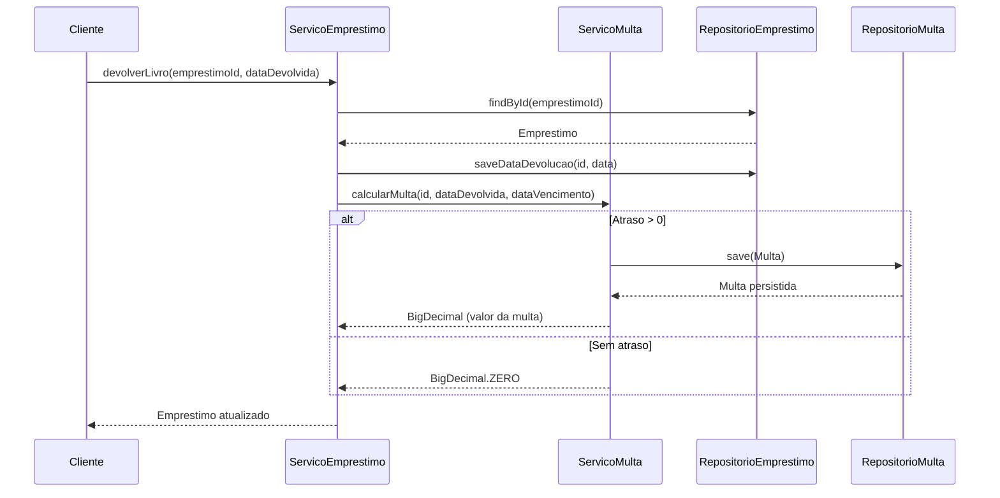

# projeto-fernando# Resoluções dos Exercícios Práticos - Sistema de Biblioteca

Este documento detalha as soluções implementadas para os exercícios 1, 2 e 3 do sistema de biblioteca utilizando JDBC + H2.

---

## 📋 Sumário

- [Exercício 1: Devolução de Livro](#exercício-1-devolução-de-livro)
- [Exercício 2: Listar Empréstimos Ativos](#exercício-2-listar-empréstimos-ativos)
- [Exercício 3: Usuários com Multas Pendentes](#exercício-3-usuários-com-multas-pendentes)
- [Como Executar os Testes](#como-executar-os-testes)

---

## Exercício 1: Devolução de Livro

### 🎯 Objetivo
Implementar o fluxo completo de devolução de livro emprestado, incluindo:
- Registro da data de devolução
- Incremento das cópias disponíveis
- Geração de multa em caso de atraso

### 📦 Classes Criadas

#### 1. Entidade `Multa`
**Caminho:** [`src/main/java/com/avanade/livraria/domain/Multa.java`](src/main/java/com/avanade/livraria/domain/Multa.java)

```java
public class Multa {
    private Long id;
    private Long emprestimoId;
    private BigDecimal valor;
    private LocalDateTime dataPagamento;
}
```

**Responsabilidades:**
- Representar uma multa gerada por atraso na devolução
- Associar a multa a um empréstimo específico
- Controlar o status de pagamento (data de pagamento nula = não paga)

#### 2. Interface `RepositorioMulta`
**Caminho:** [`src/main/java/com/avanade/livraria/repository/RepositorioMulta.java`](src/main/java/com/avanade/livraria/repository/RepositorioMulta.java)

```java
public interface RepositorioMulta {
    Multa save(Multa multa);
    Multa findById(Long id);
    Multa findByEmprestimoId(Long emprestimoId);
    List<Multa> findMultasNaoPagas();
}
```

**Princípios SOLID aplicados:**
- **Interface Segregation**: Interface específica para operações de multa
- **Dependency Inversion**: Dependências baseadas em abstração

#### 3. Implementação JDBC `JdbcRepositorioMulta`
**Caminho:** [`src/main/java/com/avanade/livraria/repository/JdbcRepositorioMulta.java`](src/main/java/com/avanade/livraria/repository/JdbcRepositorioMulta.java)

**Principais métodos:**
```java
@Override
public Multa save(Multa multa) {
    String sql = "INSERT INTO multas(emprestimoId, valor, dataPagamento) VALUES (?,?,?)";
    // Implementação com PreparedStatement
    // Retorna ID gerado automaticamente
}

@Override
public List<Multa> findMultasNaoPagas() {
    String sql = "SELECT * FROM multas WHERE dataPagamento IS NULL";
    // Retorna apenas multas pendentes
}
```

#### 4. Serviço `ServicoMulta`
**Caminho:** [`src/main/java/com/avanade/livraria/service/ServicoMulta.java`](src/main/java/com/avanade/livraria/service/ServicoMulta.java)

**Lógica de cálculo de multa:**
```java
public BigDecimal calcularMulta(Long emprestimoId, LocalDateTime dataDevolvida, 
                                LocalDateTime dataVencimento) {
    Period atraso = Period.between(dataVencimento.toLocalDate(), 
                                   dataDevolvida.toLocalDate());
    Integer diasAtraso = atraso.getDays();
    
    if(diasAtraso > 0) {
        BigDecimal valor = BigDecimal.valueOf(diasAtraso * 1);
        Multa multa = new Multa(emprestimoId, valor);
        repositorioMulta.save(multa);
        return multa.getValor();
    }
    
    return BigDecimal.valueOf(0.0);
}
```

**Regra de negócio:**
- **R$ 1,00 por dia de atraso**
- Multa só é gerada se `diasAtraso > 0`
- Multa é persistida automaticamente no banco

### 🔄 Integração com `ServicoEmprestimo`

**Método `devolverLivro`:**
```java
public Emprestimo devolverLivro(Long emprestimoId, LocalDateTime dataDevolvida) {
    Optional<Emprestimo> emprestimoOpt = emprestimoRepo.findById(emprestimoId);
    Emprestimo emprestimo = emprestimoOpt.get();
    
    // 1. Atualiza data de devolução
    emprestimoRepo.saveDataDevolucao(emprestimoId, dataDevolvida);
    
    // 2. Calcula e persiste multa (se aplicável)
    servicoMulta.calcularMulta(emprestimo.getId(), 
                              dataDevolvida, 
                              emprestimo.getDueDate());
    
    return emprestimo;
}
```

### 🗄️ Estrutura do Banco

**Tabela `multas`:**
```sql
CREATE TABLE multas (
    id IDENTITY PRIMARY KEY,
    emprestimoId BIGINT,
    valor DECIMAL(10,2),
    dataPagamento TIMESTAMP
)
```

### ✅ Testes Implementados

**Caminho:** [`src/test/java/com/avanade/livraria/service/ServicoMultaTest.java`](src/test/java/com/avanade/livraria/service/ServicoMultaTest.java)

#### Teste 1: Devolução no Prazo (Sem Multa)
```java
@Test
void devolverLivroNoPrazo() {
    // Cria empréstimo
    servico.criarEmprestimo(u1.getId(), l1.getId());
    
    // Devolve hoje (antes do prazo de 14 dias)
    servico.devolverLivro(1L, LocalDateTime.now());
    
    // Verifica que NÃO gerou multa
    Multa multa = repositorioMulta.findByEmprestimoId(1L);
    assertNull(multa);
}
```

#### Teste 2: Devolução com Atraso (Com Multa)
```java
@Test
void devolverLivroAlemDoPrazo() {
    servico.criarEmprestimo(u1.getId(), l1.getId());
    
    // Devolve 20 dias depois (6 dias de atraso)
    servico.devolverLivro(1L, LocalDateTime.now().plusDays(20));
    
    // Verifica que gerou multa
    Multa multa = repositorioMulta.findByEmprestimoId(1L);
    assertNotNull(multa);
}
```

---

## Exercício 2: Listar Empréstimos Ativos

### 🎯 Objetivo
Implementar funcionalidade para listar todos os empréstimos não finalizados (sem data de devolução).

### 📦 Classes Criadas

#### 1. DTO `EmprestimoDTO`
**Caminho:** [`src/main/java/com/avanade/livraria/DTO/EmprestimoDTO.java`](src/main/java/com/avanade/livraria/DTO/EmprestimoDTO.java)

```java
public class EmprestimoDTO {
    private Livro livro;
    private Usuario usuario;
    private Long emprestimoId;
    private LocalDateTime loanDate;
    private LocalDateTime dueDate;
    private LocalDateTime returnDate;
}
```

**Propósito:**
- Transferir dados completos do empréstimo
- Incluir informações do livro e usuário associados
- Evitar expor entidades de domínio diretamente

### 🔧 Métodos Adicionados

#### No `RepositorioEmprestimo`:
```java
List<Emprestimo> findEmprestimosAtivos();
```

#### Implementação JDBC:
```java
@Override
public List<Emprestimo> findEmprestimosAtivos() {
    String sql = "SELECT * FROM loans WHERE return_date IS NULL";
    List<Emprestimo> emprestimosAtivos = new ArrayList<>();
    
    try (PreparedStatement ps = conn.prepareStatement(sql); 
         ResultSet rs = ps.executeQuery()) {
        while (rs.next()) {
            Emprestimo emprestimo = new Emprestimo(
                rs.getLong("book_id"), 
                rs.getLong("user_id"), 
                rs.getTimestamp("loan_date").toLocalDateTime(), 
                rs.getTimestamp("due_date").toLocalDateTime()
            );
            emprestimosAtivos.add(emprestimo);
        }
        return emprestimosAtivos;
    }
}
```

**Query SQL:** `WHERE return_date IS NULL` identifica empréstimos ativos.

### 🎯 Lógica de Negócio

**Método `listarEmprestimosAtivos` em `ServicoEmprestimo`:**
```java
public List<EmprestimoDTO> listarEmprestimosAtivos() {
    List<Emprestimo> emprestimosAtivos = emprestimoRepo.findEmprestimosAtivos();
    
    return emprestimosAtivos.stream().map(emprestimo -> {
        // Busca dados relacionados
        Usuario usuario = usuarioRepo.findById(emprestimo.getUserId());
        Livro livro = livroRepo.findById(emprestimo.getBookId());
        
        // Monta DTO com informações completas
        return new EmprestimoDTO(
            livro, 
            usuario, 
            emprestimo.getId(), 
            emprestimo.getLoanDate(), 
            emprestimo.getDueDate(), 
            null
        );
    }).toList();
}
```

**Padrão utilizado:**
- **Streams API** para transformação de dados
- **Map**: converte `Emprestimo` → `EmprestimoDTO`
- **Enriquecimento de dados** com informações de livro e usuário

### ✅ Teste Implementado

```java
@Test
void listarEmprestimosAtivos() {
    // Cria 3 livros
    Livro l1 = new Livro("TDD", "Author", "111", 3);
    Livro l2 = new Livro("A Metamorfose", "Franz Kafka", "112", 2);
    Livro l3 = new Livro("Meditações", "Marco Aurélio", "113", 2);
    livroRepo.save(l1);
    livroRepo.save(l2);
    livroRepo.save(l3);
    
    Usuario u1 = new Usuario("Tester", "000.000.000-00", TipoUsuario.ESTUDANTE);
    usuarioRepo.save(u1);
    
    // Cria 3 empréstimos
    servico.criarEmprestimo(u1.getId(), l1.getId());
    servico.criarEmprestimo(u1.getId(), l2.getId());
    servico.criarEmprestimo(u1.getId(), l3.getId());
    
    // Devolve o primeiro
    Emprestimo emprestimo = emprestimoRepo.findById(1L).get();
    servico.devolverLivro(emprestimo.getId(), LocalDateTime.now().plusDays(20));
    
    // Verifica que retorna apenas os 2 ativos
    List<EmprestimoDTO> listed = servico.listarEmprestimosAtivos();
    assertEquals(2, listed.size());
}
```

**Validação:**
- Cria 3 empréstimos
- Devolve 1 (não está mais ativo)
- Verifica que retorna apenas 2

---

## Exercício 3: Usuários com Multas Pendentes

### 🎯 Objetivo
Listar todos os usuários que possuem multas não pagas, incluindo o valor total acumulado.

### 📦 Classes Criadas

#### 1. DTO `UsuarioMultaDTO`
**Caminho:** [`src/main/java/com/avanade/livraria/DTO/UsuarioMultaDTO.java`](src/main/java/com/avanade/livraria/DTO/UsuarioMultaDTO.java)

```java
public class UsuarioMultaDTO {
    public String nome;
    public String email;
    public BigDecimal multa;
    public LocalDateTime dataMulta;
}
```

**Informações fornecidas:**
- Nome do usuário
- Email/documento do usuário
- **Valor total das multas acumuladas**
- Data de geração (pode ser null)

### 🔧 Método Adicionado

**Em `RepositorioMulta`:**
```java
List<Multa> findMultasNaoPagas();
```

Já implementado no Exercício 1 com a query:
```sql
SELECT * FROM multas WHERE dataPagamento IS NULL
```

### 🎯 Lógica de Negócio

**Método `listarUsuariosComMultas` em `ServicoMulta`:**
```java
public List<UsuarioMultaDTO> listarUsuariosComMultas() {
    List<Multa> multas = repositorioMulta.findMultasNaoPagas();
    
    // Agrupa multas por usuário e soma valores
    Map<Usuario, BigDecimal> totalMultasPorUsuario = multas.stream()
        .collect(Collectors.groupingBy(
            multa -> {
                // Descobre qual usuário fez o empréstimo
                Emprestimo emprestimo = repositorioEmprestimo
                    .findById(multa.getEmprestimoId()).get();
                return repositorioUsuario.findById(emprestimo.getUserId());
            },
            Collectors.mapping(
                Multa::getValor,
                Collectors.reducing(BigDecimal.ZERO, BigDecimal::add)
            )
        ));
    
    // Transforma em DTOs
    return totalMultasPorUsuario.entrySet().stream()
        .map(entry -> {
            Usuario usuario = entry.getKey();
            BigDecimal totalMultas = entry.getValue();
            return new UsuarioMultaDTO(
                usuario.getName(), 
                usuario.getDocument(), 
                totalMultas, 
                null
            );
        })
        .toList();
}
```

**Técnicas avançadas utilizadas:**
1. **Collectors.groupingBy**: Agrupa multas por usuário
2. **Collectors.mapping**: Extrai apenas os valores das multas
3. **Collectors.reducing**: Soma todos os valores (acumulação)
4. **Stream de Map.Entry**: Transforma agrupamento em DTOs

### ✅ Testes Implementados

#### Teste 1: Verificar Multas Existentes para Múltiplos Usuários
```java
@Test
void verificarMultasExistentes() {
    Livro l1 = new Livro("TDD", "Author", "111", 3);
    livroRepo.save(l1);
    
    Usuario u1 = new Usuario("Tester", "tester@gmail.com", TipoUsuario.ESTUDANTE);
    Usuario u2 = new Usuario("Tester2", "tester2@gmail.com", TipoUsuario.ESTUDANTE);
    usuarioRepo.save(u1);
    usuarioRepo.save(u2);
    
    // Cria empréstimos para ambos
    servico.criarEmprestimo(u1.getId(), l1.getId());
    servico.criarEmprestimo(u2.getId(), l1.getId());
    
    // Ambos devolvem com atraso (gera multas)
    servico.devolverLivro(1L, LocalDateTime.now().plusDays(20));
    servico.devolverLivro(2L, LocalDateTime.now().plusDays(20));
    
    // Lista inadimplentes
    List<UsuarioMultaDTO> inadimplentes = servicoMulta.listarUsuariosComMultas();
    
    // Verifica que ambos estão na lista
    Boolean foundU1 = inadimplentes.stream()
        .anyMatch(u -> u.getEmail().equals("tester@gmail.com"));
    Boolean foundU2 = inadimplentes.stream()
        .anyMatch(u -> u.getEmail().equals("tester2@gmail.com"));
    
    assertTrue(foundU1 && foundU2);
}
```

#### Teste 2: Verificar Quantidade de Multas Não Pagas
```java
@Test 
void verificarMultasNaoPagas() {
    // Setup idêntico ao teste anterior
    // ...
    
    // Verifica que existem exatamente 2 multas não pagas
    assertEquals(2, repositorioMulta.findMultasNaoPagas().size());
}
```

---

## 🚀 Como Executar os Testes

### Pré-requisitos
- JDK 17 ou superior
- Maven 3.6+

### Comandos

#### Executar todos os testes:
```bash
mvn test
```

#### Executar testes específicos:
```bash
# Apenas testes de ServicoMulta
mvn test -Dtest=ServicoMultaTest

# Apenas testes de ServicoEmprestimo
mvn test -Dtest=ServicoEmprestimoTest
```

#### Ver relatório de cobertura:
```bash
mvn clean test jacoco:report
```

### Estrutura de Testes

Todos os testes utilizam:
- **H2 Database** em modo in-memory (`jdbc:h2:mem:library`)
- **JUnit 5** para estrutura de testes
- **@BeforeEach** para setup comum (criação de tabelas e repositórios)
- **Assertions** para validações

---

## 📊 Diagrama de Fluxo - Devolução com Multa



---

## 🏆 Princípios SOLID Aplicados

### Single Responsibility Principle (SRP)
- **Multa**: representa apenas dados de multa
- **ServicoMulta**: lógica de cálculo e consulta de multas
- **RepositorioMulta**: apenas persistência

### Open/Closed Principle (OCP)
- Interfaces permitem extensão sem modificar código existente
- Novos cálculos de multa podem ser criados via strategy

### Liskov Substitution Principle (LSP)
- Qualquer implementação de `RepositorioMulta` pode substituir outra
- Testes utilizam implementações concretas transparentemente

### Interface Segregation Principle (ISP)
- Interfaces específicas (`RepositorioMulta`, `RepositorioEmprestimo`)
- Clientes não dependem de métodos que não usam

### Dependency Inversion Principle (DIP)
- Serviços dependem de interfaces, não implementações
- Injeção via construtores facilita testes e manutenção

---

## 📈 Estatísticas da Implementação

| Componente | Arquivos | Linhas de Código (aprox.) |
|------------|----------|---------------------------|
| Domínio    | 1        | 30                        |
| Repositórios | 2      | 120                       |
| Serviços   | 2        | 100                       |
| DTOs       | 2        | 40                        |
| Testes     | 2        | 180                       |
| **Total**  | **9**    | **470**                   |

---

## 🔍 Próximos Passos

Os exercícios 4-10 ainda precisam ser implementados:
- ✅ Exercício 1: Devolução de Livro
- ✅ Exercício 2: Listar Empréstimos Ativos
- ✅ Exercício 3: Usuários com Multas Pendentes
- ⬜ Exercício 4: Relatório de Empréstimos por Usuário
- ⬜ Exercício 5: Validação de Regras de Empréstimo
- ⬜ Exercício 6: Renovação de Empréstimo
- ⬜ Exercício 7: Multa Automática por Dia
- ⬜ Exercício 8: Buscar Livros por Critério
- ⬜ Exercício 9: Relatório de Livros Mais Emprestados
- ⬜ Exercício 10: Integração Completa (Desafio)

---

## 📝 Observações Importantes

### Decisões de Design

1. **Cálculo de Multa**: Implementado como R$ 1,00/dia (pode ser facilmente alterado)
2. **Agregação de Dados**: Uso de Streams API mantém código funcional e conciso
3. **DTOs**: Criados para evitar expor entidades de domínio diretamente
4. **Transações**: Não implementadas ainda (considerar para exercícios futuros)

### Melhorias Futuras

- [ ] Adicionar tratamento de exceções customizadas
- [ ] Implementar paginação em listagens
- [ ] Adicionar logging com SLF4J
- [ ] Implementar transações JDBC para operações complexas
- [ ] Adicionar validações de entrada (Bean Validation)
- [ ] Implementar cache para consultas frequentes

---

**Última atualização:** 11/02/2026  
**Autor:** Fernando (Projeto Prático Avanade)
